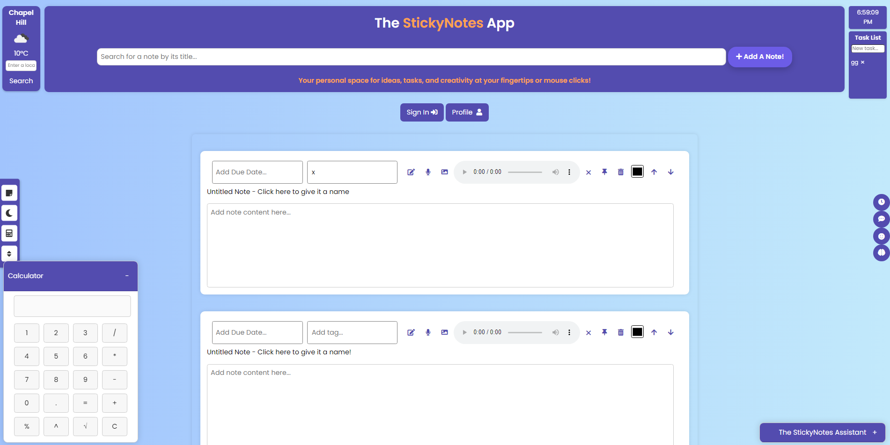

# The StickyNotes App

## Overview

The StickyNotes App is a dynamic, user-friendly web application designed for effective note-taking and task management. Developed by [Son Nguyen](https://github.com/hoangsonww) in 2023, it offers a versatile suite of features, including voice note recording, color customization, tagging, and more. Suitable for both personal and professional use, StickyNotes hopes to provide you with its intuitive design and robust functionality. A mobile app version is also under development, leveraging Apache Cordova and React Native, with a planned release in the near future.

In the meantime, feel free to explore the web app and discover its many capabilities at [this link](https://hoangsonww.github.io/The-StickyNotes-App/). Whether you're a student, professional, or creative individual, StickyNotes is here to help you stay organized and productive!

## User Interface

  

## Features

- **Note Creation and Editing:** Easy-to-use interface for creating and modifying notes. Supports markdown for enhanced formatting.
- **Drag and Drop Functionality:** Conveniently rearrange notes on your screen by dragging them to different positions.
- **Pinning Notes:** Prioritize important notes by pinning them to the top of the screen.
- **Voice Note Recording:** Quickly capture ideas with the integrated voice recording feature.
- **Color Customization:** Personalize notes with custom colors for better organization and visual appeal.
- **Tagging and Due Dates:** Organize your notes with tags and keep track of deadlines with due date settings.
- **Search Functionality:** Efficiently locate specific notes using the built-in search feature.
- **Dark Mode:** Switch between light and dark themes for an optimal visual experience.
- **Import/Export Functionality:** Easily back up or transfer notes with JSON file import/export options.
- **Auto-Save:** Automatically saves notes to local storage to prevent data loss.
- **Calculator, Mood Tracker, and Timer:** Built-in tools for enhanced productivity.
- **Chatbot Integration:** A great chatbot that assists with user queries about the app.

## Technology Stack
- **Frontend:** HTML, CSS, JavaScript, jQuery, Bootstrap, Font Awesome, React, Vue.js (Micro-frontends Architecture).
- **Backend:** Node.js, Django, Flask (Micro-services Architecture).
- **Database:** Google Firebase, MySQL.
- **Middleware:** Express, Django REST Framework.
- **APIs:** Google Cloud Speech-to-Text, Text-to-Speech, Translation, Natural Language, Personalized Recommendations, and Notes Storage for Users.

## Project Structure
- **`StickyNotes-Frontend` Directory:** Contains the frontend codebase for the StickyNotes App.
- **`StickyNotes-Backend` Directory:** Contains the backend codebase for the StickyNotes App.
- **`StickyNotes-Mobile-App` Directory:** Contains the mobile app codebase for the StickyNotes App.
- **`.github` Directory:** Contains the documentation for the StickyNotes App.
- **`utils` Directory:** Contains utility scripts and tools for the StickyNotes App.

## Installation and Setup

1. Clone the repository from [GitHub](https://github.com/hoangsonww/The-StickyNotes-App).
2. Install necessary dependencies with `npm install`.
3. Simply pen `index.html` or run `npm start` in a web browser to start using the app. Alternatively, deploy the app on a web server for public access.

## Usage

### Basic Operations
- **Adding a Note:** Click "Add A Note!" to create a new note.
- **Editing a Note:** Click the edit button (pencil icon) on a note.
- **Deleting a Note:** Click the delete button (trash can icon) on a note.
- **Exporting/Importing Notes:** Use the "Export Notes" and "Import Notes" buttons for data backup and restoration.

### Advanced Features
- **Recording Voice Notes:** Click the microphone icon for audio recording.
- **Customizing Note Colors:** Select new colors for notes using the color picker.
- **Tagging and Setting Due Dates:** Use the tag and due date fields in the note toolbar.
- **Searching and Sorting Notes:** Utilize the search box and "Sort Notes" button for organization.
- **Interacting with Eliza:** Engage with the chatbot for assistance and information.
- **Using the Calculator:** Enter mathematical expressions in the calculator for instant results.
- **Using the Mood Tracker:** Select a mood from the dropdown menu to track your feelings.
- **Using the Pomodoro Timer:** Enter a time in the timer field and click "Start" to begin the countdown.
- **Switching Themes:** Use "Toggle Dark Mode" for theme switching.
- **Using the Calendar:** Click the calendar button to view the current date, as well as your notes' due dates on the calendar.
- **Using the Weather Widget:** Click the weather button to view the current weather in your location.
- **Using the Quotes Center:** Click the quotes button to view 3 random inspirational quotes.

## Customization

- **Theme Toggle:** Use "Toggle Dark Mode" for theme switching.
- **Color Customization:** Individual color choices for each note.
- **Tagging and Due Dates:** Organize notes with tags and due dates.
- **Drag and Drop Functionality:** Rearrange notes by dragging them to different positions.
- **Move Notes**: Prefer not to use drag and drop? Use the "Move Notes" buttons to move notes around.
- **Pinning Notes:** Pin important notes to the top of the screen for easy access.

## Data Management

- **Export/Import Notes:** Backup and restore notes with JSON file functionality.
- **Profile and Note Data Cloud Storage:** Securely store user data in the cloud for easy access and synchronization using Firebase.

## Future Enhancements

- Real-time collaboration features.
- Cloud syncing for cross-device note management.
- Enhanced customization options (fonts, themes).
- Advanced calculator functionalities.
- More sophisticated note-taking features (drawing, handwriting recognition).
- Improved search capabilities (voice, image search).
- Enhanced sorting (by tags, colors).
- Advanced data management (cloud storage, encryption).

## Contributing

Contributions to the StickyNotes App are welcome! Please read our [Contributing Guidelines](CONTRIBUTING.md) for more information.

## Support and Feedback

For support, feedback, or contributions, refer to the GitHub repository's issues section or contact the developer directly.

Author: [Son Nguyen](https://github.com/hoangsonww).

Email: [info@movie-verse.com](mailto:info@movie-verse.com).

---
